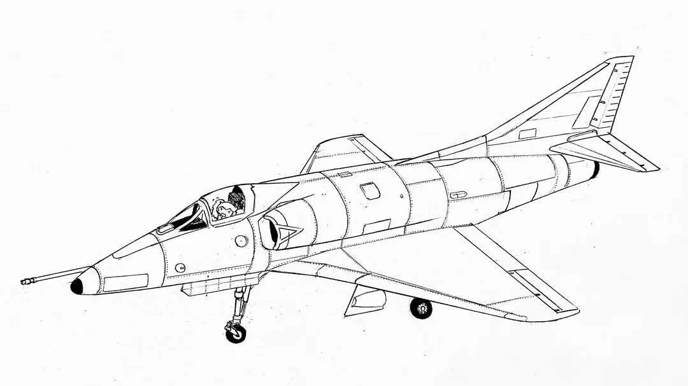

# Skyhawk

<p align="center">
  
</p>

A compiler for JOVIAL J73 (MIL-STD-1589C), written in C99.
Just 12,600 lines of C and a quiet determination to turn a 1970s avionics language into native
machine code on modern hardware, because someone has to and it
might as well be me.

*A-4 Skyhawk drawing by [u/JKanitsorn](https://www.reddit.com/user/JKanitsorn)*

## What It Does

Skyhawk reads J73 source and produces native object files through a
pipeline that would be familiar to anyone who's built a compiler, and
mildly alarming to anyone who hasn't:

```
.jov source
    |
  lexer        tokens
    |
  parser       AST
    |
  sema         typed AST + TABLE layout
    |
  JIR          SSA intermediate representation
    |
  mem2reg      alloca promotion, PHI insertion
    |
  regalloc     linear scan register allocation
    |
  codegen      x86-64 (PE-COFF) or RV64IMFD (ELF)
    |
  .obj / .o
```

Two backends. Zero external dependencies. The entire compiler fits in
a single static executable that builds in under a second.

## Backends

**x86-64** (Windows PE-COFF): The original backend. Win64 ABI, proper
register allocation, COMPOOL symbol export. Link with MSVC or MinGW.

**RISC-V 64** (ELF): RV64IMFD targeting Linux. Integer, multiply/divide,
single and double float. Standalone executables run under `qemu-riscv64`
for testing. Because if you're going to support a Cold War programming
language, you might as well target the ISA that's trying to democratise
hardware.

**Planned backends** ARM and the original MIL-STD-1750A are both in the works. Currently working on making an emulator for the MIL-STD-1750A ISA as its not like I can knock on Qemu's door and ask like its a cup of sugar.

## Building

```
make            # build skyhawk.exe
make test       # build and run the test suite (135 tests)
```

Requires GCC (MinGW on Windows, native on Linux). No configure step,
no CMake, no autotools. The Makefile is 30 lines.

## Usage

```
skyhawk -o output.obj input.jov          # x86-64 PE-COFF object
skyhawk --rv -o output.o input.jov       # RV64 ELF object
skyhawk --cpl compool.cpl input.jov      # import COMPOOL before compile
skyhawk --ir input.jov                   # dump JIR SSA (for debugging)
skyhawk --lex input.jov                  # dump tokens (for masochists)
```

## J73 Coverage

Most of MIL-STD-1589C that matters for real programs:

- **Types**: signed/unsigned integers (8/16/32/64), floats (32/64),
  BOOLEAN, STATUS, BITWISE, FIXED (parsed, not yet arithmetic)
- **Declarations**: ITEM, TABLE (multi-dimensional, arbitrary index
  bounds), COMPOOL (inline and binary import/export)
- **Control flow**: IF/ELSE, WHILE, FOR (BY/WHILE), CASE, GOTO/LABEL
- **Procedures**: PROC with parameters, local scope, nested calls
- **Expressions**: full arithmetic, comparisons, bitwise ops (AND/OR/
  XOR/NOT), shifts, negation, LOC (address-of), dereferencing
- **STATUS values**: enumerated types with named literals

What's not here yet: I/O statements (FORMAT/PRINT/READ), string
operations, fixed-point arithmetic, OVERLAY, DEFINE macros. These
are on the roadmap.

## Architecture

```
src/
  fe/        frontend (lexer, parser, sema, layout)
  ir/        JIR SSA (lowering, mem2reg)
  x86/       x86-64 backend (emit, regalloc, PE-COFF)
  rv/        RISC-V 64 backend (emit, regalloc, ELF)
  cpl/       COMPOOL binary format (read, write)
  rt/        runtime library stubs
tests/
  tharns.h   test harness 
  trv.c      RISC-V tests (13 tests, QEMU execution)
  tx86.c     x86-64 tests (19 tests, JIT execution)
  ...        135 tests across 9 categories
```

## Tests

```
$ make test
```

The 10 skips are RISC-V QEMU tests that require `qemu-riscv64`. On a
system with QEMU installed (or WSL), all 135 pass.

Run a specific category:
```
./test_skyhawk --cat rv
./test_skyhawk --cat codegen
```

## COMPOOL

J73 COMPOOLs are the language's module system, predating C headers by
a decade and being roughly as enjoyable to work with. Skyhawk supports
both inline COMPOOLs (parsed from source) and binary `.cpl` files
(serialised type and symbol tables). A COMPOOL compiled once can be
imported by any number of programs without re-parsing.

## Why

JOVIAL J73 still runs in avionics systems that will be flying for
decades. The existing compilers are proprietary, expensive, and
increasingly unavailable. Skyhawk is an attempt to provide an open
implementation that produces real machine code from real J73 source,
without requiring a proprietary toolchain or a mainframe.

Also, writing compilers is fun and someone left the MIL-STD on the
internet where anyone could read it.

## Why Skyhawk? 

Well the Royal New Zealand Airforce flew the A4k Skyhawk for years. In fact during its lifespan it received many coats of paint and most crucially F-16 avionics whos software was written in guess what, Jovial! 

So theres a non zero chance that I am not the only Jovial programmer in New Zealand so this is both a historical project, an exercise in compiler theory and a cry for help. 

## LSP

Just like how people pair their wine with even more wine, here's an LSP for the language: [Jovial-LSP](https://github.com/Zaneham/Jovial-LSP)

## On the other Jovial compiler

Anyone having a read of my profile may notice that theres not one but two (two!!) Jovial compilers. 

The other one was my try and giving Rust a fair shot and LLVM a try. Trying to write a compiler in Rust with LLVM, for a language meant to be embedded with a chip with less memory than your smart air fryer is utterly bonkers. It's like trying trying to do open heart surgery with a rubber mallet. 

You're more than welcome to oogle and look at the other compiler, it shows a bit of character growth, but it won't be receiving as much love as this one.

## License

[Business Source License 1.1](LICENSE) with an additional perpetual
grant for the Armed Forces of Ukraine. Converts to Apache 2.0 on
2029-01-01.
